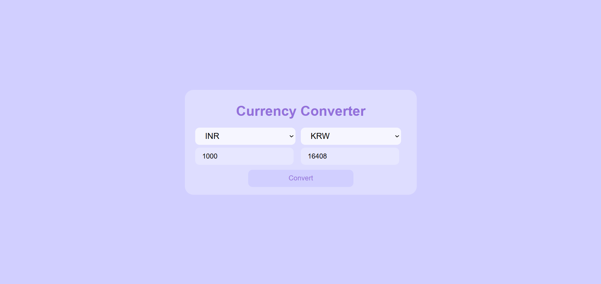

# Currency Converter

A simple currency converter web application that allows users to select two currencies, input an amount, and convert it to the target currency in real-time using the [Frankfurter API](https://www.frankfurter.app/).



## Features
- Fetches and displays available currency options from the Frankfurter API.
- Converts input currency value to a selected currency upon clicking the Convert button.
- Provides an alert if the user selects the same currency for both options.

## Technologies Used
- HTML, CSS, JavaScript for front-end.
- [Frankfurter API](https://www.frankfurter.app/) for real-time exchange rate data.

## Getting Started

### Prerequisites
- A web browser to open the `index.html` file.

### Installation
1. Clone the repository:
   ```bash
   git clone https://github.com/Krithika-N-4/Currency-Converter-Simple.git
